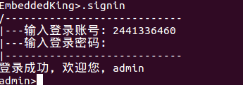

# NetWorkBookStore
# 网上书店系统

## 简介
>     此项目采用C/S模式
>     服务器端：采用基于TCP协议的多并发服务器，父进程用来处理客户端的连接请求，当一个客户端请求连接时fork一个子进程
>     在子进程中主要处理客户端发过来的协议包，解析协议包从而进行相关的处理，客户端发过来的请求类型有注册账号，登录账号
>     下载图书，上传图书，删除图书等等，服务器将账号和图书的信息存入mysql服务器中，如果为注册账号请求需查询数据库中是否有这个账户
>     如果没有则发送一个用户已存在的错误包给客户端，如果有则将账号信息存入数据库用户表中，在发送一个注册成功的包给客户端
>     登录账号同理。如果客户端发送过来一个上传图书的包，则持续的接受图书内容流，通过文件IO在服务器books文件夹下创建相关的图书文件
>     并将图书信息存入到数据库图书表中，删除图书会首先查询数据库中是否有这个文件，如果有则删除数据库中的记录并删除相关的图书
>     并返回一个删除图书成功包，否则返回一个失败包

>     客户端：通过TCP协议与服务器相连，主要接受用户在shell中输入的命令来解析命令，发送相应的协议包给服务器执行相应的动作
>     账户的类型分三种：游客、用户账户、管理员账户。游客账户权限最低，只能获取帮助，注册/登录账户，退出程序
>     用户账户由用户通过.signup命令注册获取，用户账户所拥有的权限有：注销账户，修改账户密码，获取图书列表
>     下载图书，获取图书信息。管理员admin账户由软件内置，主要负责管理服务器上的图书，权限最高
>     除了有普通账户的权限外还拥有删除账户，删除图书，上传图书的权限。

>     在错误处理上采用了errno思想，出现的任何错误都会修改errno的值，开启一个线程监听errno
>     当errno的值修改之后线程执行相应的错误处理函数，errno由函数指针实现，软件开发者也可以修改为自己的错误处理函数
>     类似于linux中信号的概念，修改错误处理函数同signal函数类似。
>     采用errno的好处在于，平时我们的错误处理是在函数返回时判断返回值来处理相应的错误，这种方法会占用主函数的执行
>     并且会造成大量的垃圾代码，而errno的处理是在errno的值被改变后，不占用主函数时间，一切的处理都在线程中执行
>     高效执行代码的同时解决了代码冗余的问题。

## install
### 安装mysql数据库
>     sudo apt-get install mysql-client
>     sudo apt-get install mysql-server
>     sudo apt-get install libmysql-dev

### 建立数据库和表
>     create database NWBS;
>     use NWBS;

>     create table book_info(
>     booknum INT AUTO_INCREMENT,
>     bookname CHAR(100) NOT NULL,
>     bookauthor CHAR(50) NOT NULL,
>     bookfilename CHAR(100) NOT NULL,
>     bookpath CHAR(200) NOT NULL,
>     PRIMARY KEY (booknum)
>     )DEFAULT CHARSET=utf8;

>     create table user_info(
>     username CHAR(20) NOT NULL,
>     useraccount CHAR(20) NOT NULL,
>     userpasswd CHAR(20) NOT NULL,
>     PRIMARY KEY (useraccount)
>     )DEFAULT CHARSET=utf8;

### 编译源文件和运行
>     make
>     ./nwbs_server <ip> <port>
>     ./nwbs_client <ip> <port>

## 图片展示
>     开启服务器，服务器不会有任何的print

>     开启客户端，进入命令行

>     游客帮助

>     注册账号成功

>     查看数据库用户信息表

>     登录账号，密码不回显

>     修改密码

>     用户帮助

>     权限不足

>     管理员登录

>     管理员帮助

>     管理员上传图书

>     查看数据库图书信息表

>     获取图片列表

>     下载图书

>     查看下载的图书

>     删除图书

>     查看文件列表，可以看到已经删除

>     退出

## 2018.5.11更
>     该系统我已经写了四天了，较前几个系统吧来说这个系统更接近于linux的编程风格
>     比如加了errno对程序进行实时的错误检测，采用多并发服务器处理客户端的请求
>     命名规范并且传输协议包更轻巧，函数分模块更科学，操作界面采用命令行的模式进行操作
>     前两个项目会等我哪天有心情再更吧
>     服务器端8个文件：
>     nwbs_errno.h、nwbs_errno.c、nwbs_handler.h、nwbs_handler.c、nwbs_menu.h、nwbs_menu.c、
>     nwbs_types.h、main.c
>     客户端6个文件：
>     nwbs_errno.h、nwbs_errno.c、nwbs_handler.h、nwbs_handler.c、nwbs_types.h、main.c

## 2018.5.12更
>     优化部分代码，修复部分bug，新增了图书列表、图书下载功能
>     用户可以从服务器获取图书列表和、下载图书
>     新增8个文件，其中Makefile和一个shell脚本文件，一键编译运行
>     服务器端4个文件：
>     nwbs_lib.h、nwbs_lib.c、Makefile、run.sh
>     客户端4个文件：
>     nwbs_lib.h、nwbs_lib.c、Makefile、run.sh 

## 2018.5.13更
>     优化部分代码，修复部分bug，新增了图书信息获取功能
>     用户可以从服务器获取指定图书的信息
>     无新增文件

## 2018.5.15更
>     优化部分代码，修复bug，新增管理员图书上传功能
>     管理员可以从本地上传至服务器
>     无新增文件

## 2018.5.19更
>     优化部分代码，修复上传文件bug，新增管理员图书删除功能
>     管理员可以删除图书
>     无新增文件
